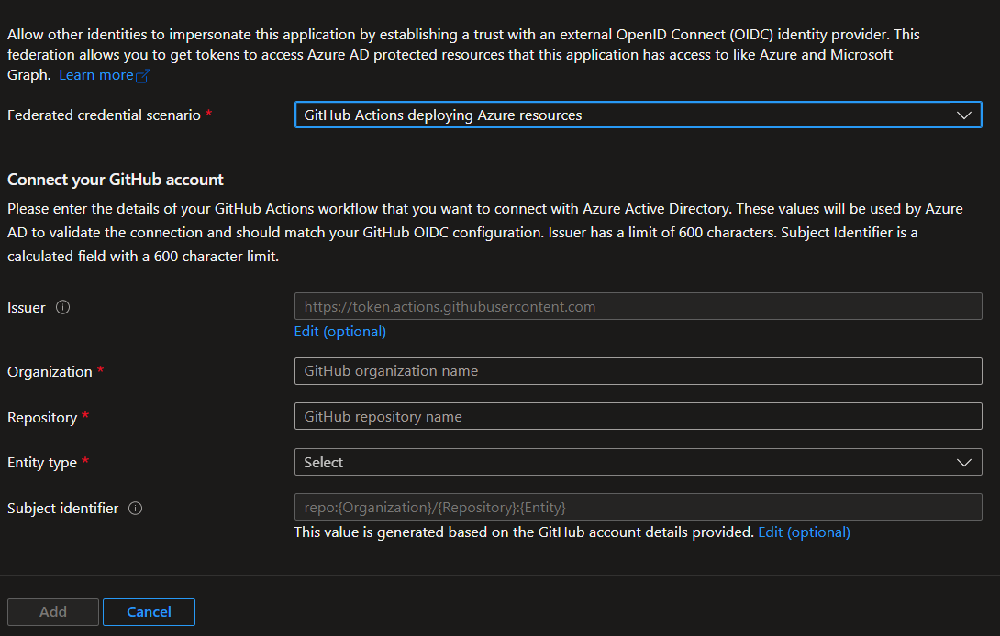

OpenID Connect (OIDC) integration between Azure Active Directory and GitHub allows your GitHub Actions workflows to securely access resources in Azure, without needing to store the Azure credentials in the GitHub action secrets.

This functionality has been available for quite a while, it was first announced on [October 2021](https://azure.microsoft.com/en-us/updates/public-preview-openid-connect-integration-between-azure-ad-and-github-actions/) and up until now, it has been on my "things to look into" list.

Recently I've been working on a project to migrate Azure DevOps to GitHub so I decided that time has come to look into this functionality.

## How a typical connection is configured
Usually, to connect to Azure as an application (i.e. when running a GitHub Action) you need to:
1. Create a Service Principal in Azure Active Directory
2. Create a Service Principal Credential
3. Grant to the Service Principal permissions on the subscription(s)
4. Copy the secret created in step 3 on your GitHub secrets
5. Authenticate the workflow using the secret created above

> Please note that the `az ad sp create-for-rbac` can simplify the process a bit since it can do steps from 1 to 3 in a single go,  more info can be found in the [documentation](https://learn.microsoft.com/en-us/cli/azure/ad/sp?view=azure-cli-latest#az-ad-sp-create-for-rbac)

## Why should you use secret-less connections
Having secret-less connections is far better than using some form of a shared secret.
Since you don't have any secrets, you can't leak any moreover shared secrets usually comes with a fixed validity. Ideally, you should rotate them often to limit the risk derived from a secret leak.

Additionally, in the case of automated infrastructure deployments, the Service Principal will have high privileges on your subscription(s) and/or possibly **Azure Active Directory** since it has to create resources, potentially assign RBAC role assignments (that require the Owner role) making the event of a secret leak even more dangerous.

With secret-less connections, on the other hand, even if the GitHub Actions secrets are leaked, an attacker can't gain direct access to the Azure subscription.

> Please note that even if you store the shared secret in GitHub secrets, it's still fairly easy to get access to the original value, see this StackOverflow [question](https://stackoverflow.com/questions/59481933/how-can-i-extract-secrets-using-github-actions) for example.

## I'm sold, now how can I set it up?
To configure OpenID Connect Integrations between Azure Active Directory and GitHub you need to do a couple of things:
1. Create an App Registration in Azure Active Directory
2. Create a Service Principal for the App Registration created above
3. Add the Federated Credential in the App Registration
4. Copy the configuration values CLIENT_ID, SUBSCRIPTION_ID and TENANT_ID in GitHub
5. Configure your workflow permissions
6. Grant to the Service Principal the desired permissions on your subscriptions(s)
7. Use the action `azure/login@v1` to login to Azure using token exchange

For a step-by-step guide, refer to the GitHub [documentation](https://docs.github.com/en/actions/deployment/security-hardening-your-deployments/configuring-openid-connect-in-azure)

## How does it work?
It's not the goal of this post to dig into the nitty-gritty details, so my explanation will be quite brief.
Under the hood, this uses **Azure Workload identities** to exchange a token issued by GitHub with a token issued by Azure Active Directory.

For the token exchange to be successful, you need to establish a trust relationship between the GitHub token issue and the Azure Active Directory. This trust relationship boils down to configuring the Federated Credential (created in step 3) in Azure Active Directory filling in the content of two of the claims issued by GitHub to the workflow, more specifically you need to fill in:
- The issuer (**iss** claim of the access token issued by GitHub)
- The subject (**sub** claim of the access token issued by GitHub)
- The audience (fixed value of `api://AzureADTokenExchange`)

Here below you can find how GitHub explains it in their announcement post.


If you want to dig deeper, here's the [documentation](https://learn.microsoft.com/en-us/azure/active-directory/develop/workload-identity-federation).

## Manual configuration
If you go to Azure Active Directory, after you created an App Registration, when you try to add Federated Credentials, the Azure Active Directory Portal helps you with filling in the required details for setting up GitHub Federated Credentials.

The screen looks like the following:


If you have to configure multiple repositories, the manual approach falls short so let's have a look at how we can configure it with Terraform.

## Terraform configuration
Since Terraform has a provider-based approach, we can configure a GitHub repository (or many) and, at the same time, create the required setup in Azure Active Directory.

Let's see how is done:

```tf
// Look-up GitHub Actions token issuer discover document
data "http" "github_actions_oidc_discovery_document" {
  url = "https://token.actions.githubusercontent.com/.well-known/openid-configuration"

  request_headers = {
    Accept = "application/json"
  }

  lifecycle {
    postcondition {
      condition     = contains([200], self.status_code)
      error_message = "Status code invalid"
    }
  }
}

locals {
  github_issuer = jsondecode(data.http.github_actions_oidc_discovery_document.response_body)["issuer"]
}

// Create an Azure Active Directory Application representing GitHub Actions
resource "azuread_application" "github_app_registration" {
  display_name = "GitHub-App-Registration"
}

// Create a Service Principal for the GitHub Actions App Registration
resource "azuread_service_principal" "github_service_principal" {
  application_id = azuread_application.github_app_registration.application_id
  use_existing   = true
}

// Create the Federated Credential for the App Registration
resource "azuread_application_federated_identity_credential" "github_federated_credentials" {
  application_object_id = azuread_application.github_app_registration.object_id
  audiences             = ["api://AzureADTokenExchange"]
  display_name          = "GitHub-FederatedCredential"
  issuer                = local.github_issuer
  // You need to decide how to configure this one accordingly to your use case
  subject               = "repo:${var.organization}/${var.repository_name}:environment:${var.environemnt}"
}

// Look-up current subscription and tenant id
data "azurerm_client_config" "current" {}

// Create a GitHub repository
resource "github_repository" "repository" {
  name        = var.repository_name
  description = var.repository_description
}

// Optional
resource "github_repository_environment" "environment" {
  environment  = var.environemnt
  repository   = github_repository.repository.name
}

// Can be just regular repository secret if you don't use environments
resource "github_actions_environment_secret" "client_id" {
  environment     = github_repository_environment.environment.environment
  repository      = github_repository.repository.name
  secret_name     = "CLIENT_ID"
  plaintext_value = azuread_application.github_app_registration.application_id
}

// Can be just regular repository secret if you don't use environments
resource "github_actions_environment_secret" "subscription_id" {
  environment     = github_repository_environment.environment.environment
  repository      = github_repository.repository.name
  secret_name     = "SUBSCRIPTION_ID"
  plaintext_value = data.azurerm_client_config.current.subscription_id
}

// Can be just regular repository secret if you don't use environments
resource "github_actions_environment_secret" "tenant_id" {
  environment     = github_repository_environment.environment.environment
  repository      = github_repository.repository.name
  secret_name     = "TENANT_ID"
  plaintext_value = data.azurerm_client_config.current.tenant_id
}

//providet.tf
terraform {
  required_providers {
    github = {
      source  = "integrations/github"
      version = "~> 5.16.0"
    }

    azuread = {
      source  = "hashicorp/azuread"
      version = "~> 2.32.0"
    }
  }

  backend "azurerm" {
    ...
  }
}

# Configure the GitHub Provider
provider "github" {
  owner = var.organization
}

```

> Please note that this Terraform configuration requires multiple providers and, to run the apply successfully, you need to be authenticated into both.

## Quirks
As you can see, the configuration is quite straightforward, but there's a catch.
Since you have to configure the subject (sub) claim in the Federated Credential with the same value of the sub claim that GitHub is issuing to your workflow and, by default, the repository name will be part of the claim value, this means you will have to create one App Registration, Federated Credential and Service Principal for each repository.

This may be fine if you have a limited number of repositories, but in my case, I had around 60 repositories that needs to be deployed.
On top of that, I (like probably most of you) have several environments e.g. Development, Testing, Acceptance, and Production and since I don't want the same Service Principal to have access to different subscriptions for security reasons, the number of App Registrations, Federated Credentials and Service Principal gets multiplied by a 4 factor (one for each environment) reaching a whopping 240.

As you can imagine this was not ideal so I decided to look at possible alternatives. What I wanted to achieve was creating 4 App Registrations, one for every environment, and use the same one across all the repositories.

> Please note that In order to achieve this you need to use GitHub deployment environments. Environments, environment secrets, and environment protection rules are available in public repositories for all products. For access to environments, environment secrets, and deployment branches in private or internal repositories, you must use GitHub Pro, GitHub Team, or GitHub Enterprise. For access to other environment protection rules in private or internal repositories, you must use GitHub Enterprise, see [documentation](https://docs.github.com/en/actions/deployment/targeting-different-environments/using-environments-for-deployment)

To achieve what I described above, I needed a way to change the content of the subject claim issued by GitHub, luckily for us, this functionality is supported by GitHub using [this](https://docs.github.com/en/rest/actions/oidc?apiVersion=2022-11-28#set-the-customization-template-for-an-oidc-subject-claim-for-an-organization) api, even better, this functionality is also supported by the GitHub Terraform provider.

> As far as I know, there's no UI support to change the content of the access token issued by GitHub yet.

## Configure the subject claim with Terraform
Here below you can see how to configure the subject claim for our use case:

```tf
resource "github_actions_repository_oidc_subject_claim_customization_template" "sub_claim_template" {
  repository = github_repository.repository.name

  use_default = false
  include_claim_keys = [
    "repository_owner",
    "context",
  ]
}

// Create the Federated Credential for the App Registration
resource "azuread_application_federated_identity_credential" "github_federated_credentials" {
  application_object_id = azuread_application.github_app_registration.object_id
  audiences             = ["api://AzureADTokenExchange"]
  display_name          = "GitHub-FederatedCredential"
  issuer                = local.github_issuer
  // You need to decide how to configure this one accordingly to your use case
  subject               = "repository_owner:${var.organization}:environment:{var.environment}"
}
```

>Please note that what you incude in the `include_claim_keys` depends on your specific scenario, this configuration allows me to add the **organization** and the **environment** in the subject claim so I can reuse the same Service Principal across all repositories for a given environment.
Also bear in mind that however you configure the GitHub sub claim, **MUST** match what's configured in the App Registration Federated Credential.

There're more customizations possible and you can learn about these in the GitHub [documentation](https://docs.github.com/en/actions/deployment/security-hardening-your-deployments/about-security-hardening-with-openid-connect#customizing-the-token-claims).

The last change you need to implement, besides granting RBAC privileges to the Service Principal on your subscriptions(s), is to configure the workflow to use token exchange to authenticate into Azure, there are two parts to it:
1. Configure the required permissions in the workflow
2. Configure the action **azure/login@v1** to use the token exchange.

Here's an example of a workflow that will work with the configuration above:

```yml
name: Azure Login with OIDC
on: [push]

permissions:
  id-token: write
  contents: read

jobs: 
  build-and-deploy:
    runs-on: ubuntu-latest
    steps:
      - name: 'Az CLI login'
        uses: azure/login@v1
        with:
          client-id: ${{ secrets.AZURE_CLIENT_ID }}
          tenant-id: ${{ secrets.AZURE_TENANT_ID }}
          subscription-id: ${{ secrets.AZURE_SUBSCRIPTION_ID }}
  
      - name: 'Run az commands'
        run: |
          az account show
          az group list
```
## Summary
As you can see, the configuration is quite straightforward and it allows you to get rid of secrets, improve your security posture **and**, as a bonus, forget about the expiring credentials issue.

I hope you found this useful.

Till the next time